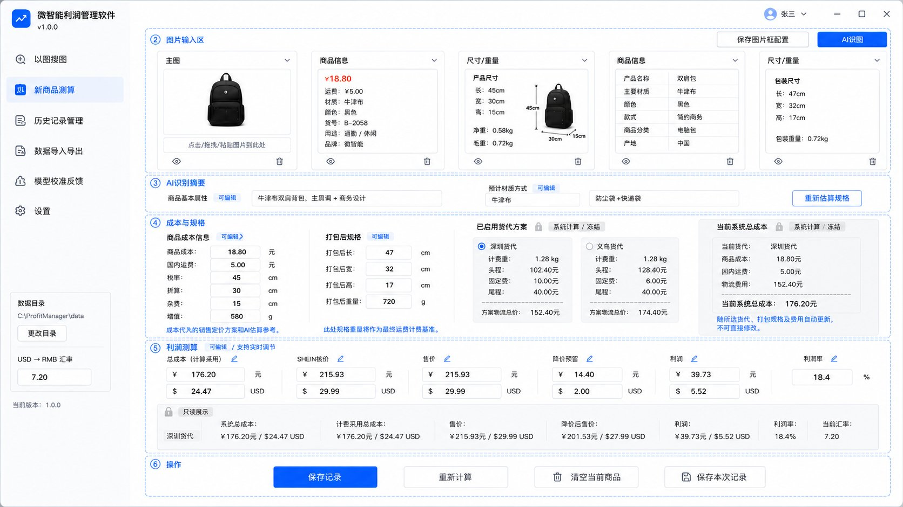

<div class="cover">

# Development rules-1.5

## 微智能利润管理软件最高产品需求、开发总规与 Agent 工作流

**项目：** `Profit accounting-Auto` / 微智能利润管理软件  
**版本：** 1.5（产品总规与开发流程融合版）  
**生效日期：** 2026-07-28  
**适用仓库：** `aidenkael/EcommerceSkills`  
**适用目录：** `E:\EcommerceSkills\Profit accounting-Auto`

> **强制暗号：本任务以 Development rules-1.5.md 为最高需求。**

该句话必须出现在以后所有涉及本软件开发、需求讨论、UI调整、物流移植、AI接入、数据设计、测试、打包和维护任务的回复开头。它代表已读取并仍记得本总规。

</div>

<div class="page-break"></div>

## 0. 文档地位与冲突处理

> **1.5版融合说明：** 本文件已合并原 `Development rules-1.0.md` 的产品、UI、业务和路线要求，以及《Agent开发流程调整细则》的任务粒度、风险分级、模型分工、测试、Git、报告和少复制粘贴规则。自本版生效后，两份旧文件仅作历史参考，不再分别作为执行依据。


### GOV-001 最高需求

`Development rules-1.5.md` 是本项目当前最高产品需求、开发边界和验收依据。

当它与以下内容冲突时，以本文件为准：

- 更早的聊天记录；
- 旧PDF、旧MD、旧交接说明；
- 已废弃的OCR弹窗设计；
- 旧代码中的临时字段和默认值；
- Agent自行推断的“更完整方案”；
- GitHub旧分支、旧报告或旧实现。

只有用户明确确认的新决定，才能修改本文件。修改流程必须是：

1. 先指出需要修改的需求编号；
2. 说明旧规则与新规则；
3. 用户确认；
4. 先升级本文档版本；
5. 再修改代码和测试。

### GOV-002 视觉基准与文字规则

经过用户确认的最终UI预览图是**最高视觉基准**；本文件是**最高功能与逻辑基准**。

- 页面分区、密度、留白、左侧导航、卡片式结构、可编辑与只读关系，应尽量贴近预览图。
- 图片生成中的错字、示例金额、示例商品、重复按钮不属于正式字段定义。
- 已确认的文字修订高于预览图：底部只保留“保存本次记录”和“清空并新建”；正常档与保守档包装规格同时展示。

### GOV-003 偏差时立即暂停

发现当前方案、代码或Agent指令与本文件不一致时，不得边开发边猜测，应立即暂停并执行第19章“偏差纠正协议”。

---

## 1. 项目定位

### PROD-001 软件本质

本软件是一个面向 Windows 的本地桌面工具，用于 SHEIN 美国站单个 SKC 的：

- 商品图片与截图录入；
- AI商品识别与包装规格估算；
- 人工快速校准；
- 深圳、义乌及未来其他货代方案计算；
- 成本、售价、利润和利润率实时测算；
- 历史记录、图片、规则快照和真实反馈沉淀；
- 后续模型与物流规则持续校准。

核心定位：

> **AI辅助识别 + 人工直接修改 + 本地确定性计算 + 历史可追溯 + 模块可更新。**

### PROD-002 核心价值

软件必须明显缩短单商品测算时间，避免用户在多个对话、脚本和文件之间反复中转。用户应在一个主页面完成：

```text
图片录入 -> AI识图 -> 人工校对 -> 包装与货代计算 -> 利润判断 -> 保存记录
```

### PROD-003 不是大型ERP

当前版本不是：

- 自动上架或发布系统；
- 全自动1688采集器；
- 多店铺、多用户权限平台；
- 云端协同系统；
- 自动训练并自改代码的AI系统；
- 通用插件市场或复杂工作流平台。

### PROD-004 第一版对象

- 单个商品；
- 单个 SKC；
- 单次处理少量图片；
- 本地数据；
- 普通用户无需理解技术字段、JSON、置信度或算法阈值。

---

## 2. 当前GitHub开发基线

### REPO-001 仓库状态（2026-07-28）

| 项目 | 当前远程状态 |
|---|---|
| 仓库 | `aidenkael/EcommerceSkills` |
| `master` | `1ac4e0864b9729be902a43358fb25b9d3b92c410`，已删除旧 `logistics-cost-skill-1.8` |
| 完整同步分支 | `codex/chore/full-progress-sync-20260728` |
| 同步报告提交 | `4396fc8b6bf9918f0876b9fae540b94a632612ab` |
| 物流2.0同步提交 | `5026d756e1633a0b859c5b5f439234b692aab61d` |
| 利润软件同步提交 | `a17dd744721bb08588bda17530dedf51b97d2a91` |
| Phase 2.1功能分支 | `codex/feature/phase-02-01-s3-field-extractors`，同步前本地HEAD `5381a297...` |

### REPO-002 已知测试状态

- `Profit accounting-Auto`：同步报告记录 `349 passed`、`3 skipped`、`1 Tcl/Tk 环境错误`、`0 failed`。
- `logistics-cost-skill-2.0`：`9 passed`、`8 failed`；失败被定位为从仓库根运行时的路径问题，必须先修复并建立全绿基线。
- `logistics-cost-skill-1.8` 已从本地和 `origin/master` 删除，历史仍可从Git记录恢复。

### REPO-003 当前代码不等于最终产品

现有 Phase 2.1 已开发图片上传、拖拽、粘贴、预览、OCR候选和回填原型，但旧的独立OCR弹窗、候选表、置信度、单位和scope操作不符合最终用户体验。

处理原则：

- 保留可复用的图片复制、剪贴板、拖拽、预览、会话和测试代码；
- 废弃复杂OCR弹窗作为最终入口；
- 不继续在旧弹窗上堆功能；
- 图片能力迁移到最终主页面图片框；
- 候选、置信度、来源等技术信息只在后台保存，不暴露给普通用户。

---

## 3. 最终UI视觉基准

<div class="ui-baseline">



**图 1：最终确认的主界面视觉基准。** 视觉布局以此图为目标；底部重复按钮无效，按本文件 UI-601 执行。正常档与保守档同时展示是图后新增的已确认修订。

</div>

### UI-001 整体结构

主窗口由两部分组成：

1. 左侧固定导航与全局设置；
2. 右侧一页式“新商品测算”主页面。

主流程不得再次跳转到复杂独立OCR管理窗口。

### UI-002 左侧导航

最终导航保留：

1. 以图搜图；
2. 新商品测算；
3. 历史记录管理；
4. 数据导入导出；
5. 模型校准反馈；
6. 设置。

底部保留：

- 当前数据目录；
- 更改目录；
- USD/CNY汇率；
- 软件版本。

不再单独设置“相似商品库”一级导航；后续相似功能应依托历史记录，且不进入当前核心开发主线。

---

## 4. 最终用户操作流程

### FLOW-001 新商品主流程

1. 进入“新商品测算”；
2. 将图片上传、拖入或粘贴到预设图片框；
3. 检查每个图片框的类型；
4. 点击“AI识图”；
5. 查看简洁的AI识别摘要；
6. 直接修改商品属性、成本、裸尺寸、裸重；
7. 同时查看正常档与保守档包装规格；
8. 必要时修改商品属性后点击“重新估算规格”；
9. 选择当前采用的包装档和货代；
10. 手动输入SHEIN核价或售价；
11. 实时查看总成本、利润、利润率与反推结果；
12. 点击“保存本次记录”，或“清空并新建”。

### FLOW-002 不要求字段完整

- 名称、材质、尺寸、重量或价格缺失时允许留空；
- 缺少关键数据时显示“待补充”，不得使用虚假默认值生成看似完整的结果；
- AI或网络失败时，手动利润测算仍必须可用。

### FLOW-003 少操作原则

- 不设置“识别结果确认向导”；
- 不设置多层候选选择表；
- 不设置“按售价/按利润率”模式切换按钮；
- 不要求用户理解置信度、证据来源、候选组、scope等内部概念；
- 所有正式字段在主页面直接编辑并实时联动。

---

## 5. 图片输入区

### IMG-001 图片框数量

- 默认 5 个图片框；
- 最少 3 个；
- 最多 6 个；
- 每个图片框只放 1 张图片，避免单框内部再做复杂多图管理；
- 多角度主图通过多个图片框都选择“主图”实现。

### IMG-002 图片框类型

只保留三类：

- 主图；
- 商品信息；
- 尺寸/重量。

同一类型可以重复出现。SHEIN核价截图类型已取消。

### IMG-003 图片录入方式

每个图片框必须支持：

- 点击上传；
- Windows资源管理器拖拽；
- `Ctrl+V` 或粘贴图片；
- 预览；
- 点击眼睛图标查看大图；
- 删除图标；
- 选中后按 `Del` 删除；
- 修改图片类型。

不设置“替换”按钮。向已有框重新上传、拖入或粘贴时，直接询问覆盖当前图片或先删除后加入，交互必须简洁。

### IMG-004 保存图片框配置

“保存图片框配置”只保存：

- 图片框数量；
- 图片框顺序；
- 每个框的默认类型。

不保存当前商品图片。新增、减少图片框可在轻量配置状态中显示小型 `+/-`，正常使用状态不增加杂乱按钮。

### IMG-005 多角度主图与AI成本

多角度主图对包类、收纳、结构复杂和遮挡商品有必要。第一版默认支持：

- 最多 3 张主图参与视觉判断；
- 1 张商品信息图；
- 1 张尺寸/重量图；
- 超出时由用户明确选择参与本次AI识图的图片。

不开发复杂自动相似图去重系统；只进行基础尺寸压缩和调用数量限制。

---

## 6. AI识图与识别摘要

### AI-001 正式识别方式

正式方案使用外部视觉模型API，不把本地OCR作为主要识别方案。当前本地OCR代码可以作为实验、测试或未来离线辅助，但不得主导最终UI和产品逻辑。

### AI-002 AI识图职责

“AI识图”重新读取当前参与识别的图片，并输出：

- 商品类型/名称；
- 主要材质；
- 软硬程度；
- 可折叠性、可压缩性、是否需要保形；
- 简洁商品属性描述；
- 商品信息图中的商品成本、国内运费及明确文字信息；
- 尺寸/重量图中的裸尺寸、裸重、包装尺寸、包装重量候选；
- 正常档包装方案；
- 保守档包装方案；
- 包装方式与一句话理由。

### AI-003 AI不得决定的内容

AI不得直接决定或写入：

- 货代费率；
- 汇率；
- 体积重除数；
- 计费重量公式；
- 头程费用；
- 固定服务费；
- 尾程费用；
- 总成本；
- 利润和利润率；
- 最终货代选择。

这些全部由本地确定性程序处理。

### AI-004 主界面摘要

主界面只显示 1-2 组简洁内容：

- 商品基本属性（可编辑）；
- 预计材质/包装方式（可编辑）；
- 必要时显示简短风险提醒。

不显示候选表、置信度、坐标、证据索引、原始OCR行、group_id或scope。

### AI-005 原始值与人工值

后台必须分别保存：

```text
AI原始输出
人工当前采用值
是否人工修改
修改时间
模型与提示词版本
```

人工输入优先级最高，AI不得静默覆盖用户已修改的字段。

### AI-006 重新估算规格

“重新估算规格”与“AI识图”严格分开：

- AI识图：重新读取图片，更新商品识别结果和包装建议；
- 重新估算规格：不重新识别图片，只使用当前商品属性、人工修改值、校准规则和物流引擎，重新生成正常档/保守档包装规格。

当用户修改材质、软硬、可折叠性等上游信息后，应标记原包装估算“已过期”，提示用户重新估算。

### AI-007 缺失数据

正式软件禁止使用物流2.0旧schema中的通用假默认值（例如固定 15×10×4 cm、0.05 kg）冒充真实识别结果。缺失时必须：

- 留空；
- 标记需要人工确认；
- 只输出可计算的部分；
- 不生成虚假完整利润。

---

## 7. 成本、裸件和包装规格

### SPEC-001 商品成本信息

正式可编辑字段：

- 商品成本（RMB）；
- 国内运费/发往中转仓运费（RMB）；
- 裸长（cm）；
- 裸宽（cm）；
- 裸高（cm）；
- 裸重（g）。

重量在UI统一显示克，内部需要时自动换算为千克。

### SPEC-002 正常档与保守档

主界面必须同时展示：

| 正常档 | 保守档 |
|---|---|
| 包装方式 | 偏谨慎包装方式 |
| 包装后长宽高 | 包装后长宽高 |
| 包装后重量 | 包装后重量 |
| 简洁说明 | 风险余量说明 |

正常档默认作为当前计算采用方案；用户可切换保守档。两档都允许人工修改，但人工修改不覆盖AI原始值。

### SPEC-003 保守档含义

保守档不是商品最大展开尺寸，也不是无上限放大。它表示：

> 在真实可发货、合理折叠/压缩和必要保护基础上，使用偏谨慎的余量。

### SPEC-004 包装规格失效

修改以下字段后，旧包装估算应标记失效：

- 商品类型；
- 材质；
- 软硬程度；
- 可折叠性；
- 可压缩性；
- 是否保形；
- 裸尺寸或裸重。

失效后不会静默自动调用付费AI；由用户点击“重新估算规格”。

---

## 8. 物流估算工具2.0移植

### LOG-001 移植目标

现有 `logistics-cost-skill-2.0` 的核心能力应成为软件内部的物流引擎，而不是运行时继续依赖Agent或CLI文件中转。

目标链路：

```text
图片 -> 视觉API结构化JSON -> 物流适配层 -> 物流2.0核心 -> 费用结果 -> 主UI
```

### LOG-002 保留能力

优先保留和迁移：

- AI统一JSON契约；
- 证据仲裁；
- 尺寸、重量单位规范化；
- 页面展示尺寸、裸件尺寸、包装尺寸语义区分；
- 正常档/保守档包装方案；
- 软品展开尺寸保护；
- 可信重量修正；
- 异常提示与人工复核；
- 现有CAL样本与回归测试。

### LOG-003 移植前必须修正

1. 修复8个测试路径问题，建立全绿基线；
2. 货代配置由利润软件注入，不能继续硬编码；
3. 废弃“包类80/非包类100”的旧费率分流；
4. 输出拆分重量头程费、固定服务费、尾程费和物流总费用；
5. 经验规则与阈值从Python源码分离到版本化校准包；
6. 缺失数据不得静默填充假尺寸和假重量；
7. 统一软件字段、单位、错误码和版本字段；
8. 先做影子对比，不直接替换当前稳定利润计算链路。

### LOG-004 当前默认货代规则

当前默认业务规则：

| 货代 | 重量头程费 | 固定服务费 |
|---|---:|---:|
| 深圳货代 | 80 RMB/kg | 10 RMB/单 |
| 义乌货代 | 100 RMB/kg | 6 RMB/单 |

两家其余计费规则相同：

```text
体积重 = 包装长 × 包装宽 × 包装高（cm）÷ 8000
计费重量 = max（包装后实重，体积重）
重量头程费 = 计费重量 × 货代单价
物流总费用 = 重量头程费 + 固定服务费 + 尾程费用
```

当前尾程默认 40 RMB，可配置。以上均为初始配置，不得永久写死在UI或计算函数中。

### LOG-005 货代配置

普通用户可在设置中修改清晰的业务参数：

- 货代名称；
- 每公斤单价；
- 固定服务费；
- 体积重除数；
- 尾程费用；
- 启用/停用；
- 排序。

现有动态货代能力应继续保留。名称可改，但稳定内部ID不得改变历史关联。

### LOG-006 主界面货代展示

每个启用货代卡片显示：

- 计费重量；
- 重量头程费；
- 固定服务费；
- 尾程费用；
- 方案物流总费用。

系统推荐仅作为提示，不强制采用。当前选择的包装档（正常/保守）决定货代卡片使用哪套规格计算。

### LOG-007 当前系统总成本

“当前系统总成本”区域只读展示：

- 当前包装档；
- 当前货代；
- 商品成本；
- 国内运费；
- 物流费用；
- 当前系统总成本。

新商品未保存时显示“系统计算/只读”；保存后才称为“已保存快照/冻结”。

---

## 9. 利润测算与实时联动

### PROFIT-001 SHEIN核价

SHEIN二次核价完全手动录入，不再通过图片识别。UI以USD为主要输入，同时显示RMB换算。

### PROFIT-002 可编辑目标

利润测算区支持直接编辑：

- 计算采用总成本（用于临时模拟，不改变下方系统成本明细）；
- SHEIN核价；
- 实际售价；
- 降价预留；
- 目标利润；
- 目标利润率。

金额字段尽量同时显示人民币和美元；利润率仅显示百分比。

### PROFIT-003 最后修改字段决定方向

不设置“反推模式”按钮。软件根据用户最后修改的关键字段决定计算方向：

- 改售价 -> 计算利润和利润率；
- 改利润 -> 反推售价；
- 改利润率 -> 反推售价；
- 改降价预留 -> 重新计算利润；
- 改临时采用总成本 -> 只进行本次模拟试算。

必须防止字段循环更新。

### PROFIT-004 只读结果条

利润区下方保留只读结果条，始终显示：

- 当前包装档/货代；
- 系统总成本；
- 计算采用总成本；
- 售价；
- 降价后售价；
- 利润；
- 利润率；
- 当前汇率。

该区域用于区分“用户输入/模拟”与“当前最终计算结果”。

### PROFIT-005 统一计算引擎

UI、AI和OCR不得编写第二套利润公式。所有结果必须调用现有或重构后的 `profit_engine` 纯函数。

当前利润规则还应支持版本化配置，包括已确认的：

- 推广预留比例；
- 29 USD 以下商品的 2.99 USD 运费补贴规则（可配置）；
- 汇率换算；
- 未来经用户确认的利润调整项。

历史记录必须保存当时的利润规则版本和具体参数。

---

## 10. 底部按钮与动作边界

### UI-601 最终底部按钮

底部只保留两个主按钮：

1. **保存本次记录**；
2. **清空并新建**。

删除预览图中重复的“保存记录/保存本次记录”和“重新计算”。利润实时计算；包装重估已有“重新估算规格”，无需第三个计算按钮。

### UI-602 保存本次记录

点击后：

- 将临时图片持久化；
- 保存商品正式字段；
- 保存AI原始JSON与人工校准值；
- 保存正常档与保守档；
- 保存当前采用包装档与货代；
- 保存物流、利润、汇率和调整规则快照；
- 保存模型、提示词、物流引擎和校准版本；
- 保存完成后页面和图片不自动清空。

保存不等于上架。商品状态后续在历史记录中维护。

### UI-603 清空并新建

点击后：

- 检查未保存修改；
- 有未保存内容时二次确认；
- 清空当前临时图片、AI结果、人工字段和模拟值；
- 创建新的临时商品会话；
- 不删除已保存历史记录；
- 不删除用户电脑中的原始图片。

---

## 11. 图片、记录和快照生命周期

### DATA-001 正式保存前

图片和识别结果属于当前临时会话：

- 在主页面持续可见；
- AI识图和重新估算后不清空；
- 可以删除、查看和重新分类；
- 不进入正式商品历史；
- 可清理临时缓存，但不得影响已保存记录。

### DATA-002 正式保存后

图片复制到当前用户数据目录，例如：

```text
<data_root>/products/<product_id>/images/
```

SQLite只保存相对路径和元数据。用户源文件不移动、不覆盖、不删除。

### DATA-003 保存内容

正式记录至少保存：

- 商品唯一ID；
- 图片、类型、顺序、原始文件名、哈希；
- AI原始输出；
- 人工校准值；
- 裸件信息；
- 正常档/保守档包装信息；
- 当前采用档与货代；
- 各项物流费用；
- SHEIN核价、售价、利润和利润率；
- 商品状态；
- 模型、引擎、校准和规则版本；
- 创建和更新时间。

### DATA-004 快照

第一版保持简单但安全：

- 首次正式保存生成不可变初始快照；
- 当前记录可以继续修改和保存最新状态；
- 新规则不得自动重算或覆盖旧快照；
- 用户主动点击“按当前规则重算”时，生成新结果但保留旧快照；
- 暂不开发复杂的全版本时间线，避免过度开发。

### DATA-005 历史记录管理

历史页必须支持：

- 搜索和打开记录；
- 直接显示已保存图片；
- 恢复图片框类型和顺序；
- 查看AI原始值与人工值；
- 修改核价、售价和状态；
- 录入实际包装、重量和物流费用；
- 查看估算误差；
- 删除前二次确认；
- 使用保存时快照展示历史结果。

建议状态：待核价、已核价、已上架、未上架、已下架。

### DATA-006 数据目录与迁移

所有正式数据保存在用户选择的数据目录。第一版不做云同步；多电脑迁移通过复制完整数据目录完成，必须包含：

- SQLite数据库；
- 图片；
- 配置；
- 校准包；
- 模块版本记录；
- 备份。

---

## 12. 以图搜图、导入导出、校准反馈和设置

### PAGE-001 以图搜图

复用已跑通的 Edge + 1688 插件能力，在同一软件壳中作为独立页面。当前职责：

- 导入图片；
- 打开用户已登录的常用Edge环境；
- 返回1688候选商品链接。

第一版不自动抓取1688完整页面，不自动把链接数据强制写入利润测算。可以保留简单“复制链接/发送图片到新商品测算”，但不得扩展成复杂采集器。

### PAGE-002 数据导入导出

第一版重点：

- 导出商品记录和图片引用；
- 导出AI估算、人工校准和实际反馈；
- 导出物流校准数据；
- 导入兼容格式；
- 依靠唯一记录ID识别新增、更新和冲突；
- 冲突时让用户选择，不静默覆盖。

不开发ERP自动同步。

### PAGE-003 模型校准反馈

该页面用于：

- 查看AI原始估算与人工校准差异；
- 录入实际包装尺寸、重量和头程费用；
- 计算误差金额、比例和方向；
- 标记数据可信度；
- 导出给Agent；
- 导入新的校准包；
- 查看当前校准版本和更新说明；
- 一键回滚上一版本。

软件不自动训练模型，不自动修改Python代码。

### PAGE-004 设置

普通用户可见设置：

- 数据目录；
- 汇率；
- 货代名称、单价、固定费、体积重除数和尾程；
- 推广预留与运费补贴；
- 默认图片框配置；
- AI服务商、模型、API密钥、图片调用上限；
- 当前校准版本；
- 备份与恢复。

专业规则（如+50g、软品阈值、品类折算率、证据优先级）不作为普通设置项。

---

## 13. 校准包与模块更新

### CAL-001 校准方式

经验规则、阈值和品类校准数据不得长期写死在业务代码中，也不让普通用户手工编辑。

流程：

```text
软件导出反馈 -> Agent分析 -> Agent生成校准包 -> 用户导入 -> 软件验证/备份/启用 -> 可回滚
```

### CAL-002 校准包格式

建议文件：

```text
logistics-calibration-YYYY.MM-vN.zip
```

至少包含：

```text
manifest.json
calibration_rules.json
release_notes.md
checksums.json
```

软件必须检查：

- 包版本；
- 适用引擎版本；
- 必填字段；
- JSON结构；
- 完整性校验；
- 与当前数据库和主程序的兼容性。

### CAL-003 普通用户操作

设置或校准页面只显示：

```text
当前校准版本
更新时间
适用引擎版本
导入校准包
查看更新说明
恢复上一版本
```

用户无需理解规则内容。

### MOD-001 模块化单体

本项目采用模块化单体，不采用微服务。建议稳定分层：

```text
ui/                    页面和控件
application/           流程编排与服务
domain/                稳定数据模型和接口契约
engines/logistics/     物流2.0核心
engines/profit/        利润计算核心
adapters/vision/       不同视觉API适配器
calibration/           校准包加载、验证、回滚
storage/               数据库、图片、快照、备份
```

UI只能调用应用服务，不能直接依赖物流引擎内部文件。

### MOD-002 稳定入口

物流服务应提供单一稳定入口，概念上类似：

```python
result = logistics_service.estimate(
    product=current_product,
    normal_scenario=normal_packaging,
    conservative_scenario=conservative_packaging,
    freight_forwarders=enabled_forwarders,
    calibration=active_calibration,
)
```

内部模块更新不能迫使UI重写。

### MOD-003 更新方式

区分两类更新：

1. 规则/数据更新：通过校准包完成，不重打包主程序；
2. 算法代码更新：通过版本化模块包完成，不让用户直接覆盖单个 `.py`。

模块包应并行保留旧版本，通过 `active_version` 切换，失败可回滚。

### MOD-004 发布形态

为了支持模块和校准独立更新，正式交付优先采用“解压即用文件夹版”：

```text
ProfitAccountingAuto.exe
modules/
calibration/
data/
```

不以单文件EXE作为唯一交付形式。用户体验仍是双击EXE，但可更新内容放在外部版本目录。

### MOD-005 不过度插件化

第一版只实现：

- 校准包导入、验证、备份、启用和回滚；
- 物流引擎稳定接口和版本字段；
- 外部模块目录预留。

暂不开发插件商店、在线自动更新服务器、任意第三方模块加载和复杂依赖管理器。

---

## 14. 明确不做与暂缓功能

### SCOPE-001 当前不做

- 1688网页全自动采集；
- 浏览器批量采集和反爬体系；
- ERP自动上架；
- 多商品批量AI识图；
- 多SKC同时核算；
- 云同步和多人权限；
- 自动训练模型；
- 软件自动改代码；
- 自动强制选择最低货代；
- 复杂候选表和技术字段展示；
- 本地OCR作为正式主识别；
- 复杂报表系统；
- 完整插件生态；
- 为未来可能性提前堆积的页面和按钮。

### SCOPE-002 当前可保留但不扩展

- 已有OCR原型：作为图片能力和测试代码来源，不作为最终产品入口；
- 历史相似：后续从历史记录中逐步增加，当前不阻塞核心版本；
- 算法模块包安装器：先设计接口，物流2.0稳定移植后再实现完整安装流程。

---

## 15. 开发架构和维护原则

### ARCH-001 分层边界

- UI层：展示、输入、状态提示，不计算业务公式；
- 应用层：组织AI、物流、利润、保存流程；
- 领域层：定义产品、图片、AI结果、包装方案、费用结果；
- 引擎层：纯计算和规则校验；
- 适配层：API、文件和外部工具差异；
- 存储层：事务、相对路径、快照和迁移。

### ARCH-002 可替换与兼容

每个可更新模块必须有：

- 输入输出schema版本；
- 模块版本；
- 最低/最高兼容主程序版本；
- 明确错误码；
- 回归测试；
- 更新说明；
- 回滚方案。

### ARCH-003 数据优先级

正式采用值优先级：

```text
用户人工值 > 明确页面/OCR值 > AI视觉预测值 > 校准默认建议 > 留空
```

任何低优先级值不得静默覆盖高优先级值。

### ARCH-004 历史稳定

- 新配置不自动重写历史；
- 新引擎不自动重算历史；
- 历史快照保存当时参数和版本；
- 用户主动重算时应对比旧结果并保留旧快照。

---

## 16. 开发工作流与 Agent 执行规则

> 本章融合原《Agent 开发流程调整细则》。它只规定“如何开发”，不得改变前文已经确定的产品功能、业务规则、UI目标和开发路线。

### DEV-001 强制开场暗号

以后所有涉及本软件的开发、需求讨论、UI调整、物流移植、AI接入、数据设计、测试、打包和维护任务，助手或 Agent 回复第一句必须是：

> **本任务以 Development rules-1.5.md 为最高需求。**

如果第一句没有出现该暗号，应视为没有正确载入项目最高需求，立即暂停并重新读取本文档。

### DEV-002 总指挥与执行者分工

默认采用：

```text
用户提出目标或反馈真实使用结果
→ ChatGPT读取总规、GitHub状态和相关历史决定
→ ChatGPT判断风险、阶段目标和验收标准
→ ChatGPT生成精简的当前任务指令
→ Agent只执行当前任务、测试、Commit和报告
→ ChatGPT集中复审并决定下一步
→ 用户只确认关键业务选择或真实GUI效果
```

职责边界：

#### ChatGPT负责

- 维护和解释 `Development rules-1.5.md`；
- 判断下一步做什么、不做什么；
- 处理旧方案、旧代码和最新需求之间的冲突；
- 决定任务粒度、风险等级、模型和测试强度；
- 输出精简 Agent 指令；
- 复审 Agent 结果和决定是否进入下一阶段。

#### Agent负责

- 读取本任务必要的规则、源码和测试；
- 在授权范围内修改代码；
- 运行指定测试；
- 形成清晰、可回退的 Git Commit；
- 生成简短阶段报告；
- 不自行扩大功能、改变业务规则或决定产品方向。

#### 用户负责

- 提出目标；
- 确认关键业务选择；
- 完成自动测试无法替代的真实GUI、真实API或真实业务验收；
- 无需反复复制完整背景、Git状态、长报告和全部规则。

### DEV-003 少复制粘贴与必要上下文原则

1. 总规固定存放在仓库中，Agent不要求用户每次重新上传或粘贴全文。
2. ChatGPT给Agent的指令只包含本任务需要的目标、边界、测试和提交要求。
3. Agent开始新阶段时应读取：
   - 根目录 `AGENTS.md`；
   - 当前项目级 `AGENTS.md`；
   - `docs/Development rules-1.5.md` 中与本任务直接相关的章节；
   - 上一阶段综合报告；
   - 当前任务涉及的源码和测试。
4. 除非任务确实涉及，不应重复完整读取：
   - 全部历史报告；
   - 所有旧版本方案；
   - 与当前模块无关的源码；
   - 已明确作废的业务规则。
5. 用户通常只需把Agent最终摘要或异常反馈给ChatGPT，不需转发完整执行日志。
6. 机械信息应由仓库脚本自动获取，不让用户在不同对话间人工搬运。

### DEV-004 指令生成前开发逻辑检查

每次生成 Codex 或其他 Agent 指令前，ChatGPT必须先简短报告该指令是否符合以下开发思路：

- 中等粒度模块开发；
- 风险分级验收；
- 一个阶段连续完成 2～4 个紧密相关步骤；
- 小修正不反复暂停；
- 每个可回退步骤分别 Commit；
- 阶段结束集中复审；
- 开发中局部测试、步骤结束关联测试、阶段结束全量测试；
- 机械报告和 Git 统计脚本化；
- 用户只参与关键确认和真实使用验收。

发现仍沿用“一个小函数一个阶段、每次都全量测试、每个小修正都停下来”的旧流程时，应先修正指令再输出。

### DEV-005 开发步骤粒度

一个开发步骤默认完成一个可独立验收的小模块，而不是零散代码单元。

通常可包含：

- 1 个明确模块目标；
- 2～5 个紧密相关子任务；
- 约 3～8 个相关文件；
- 必要测试；
- 1 次独立 Git Commit。

数字只是参考，以功能关联性为准，不得为了凑数量强行合并无关任务。

适合合并的示例：

- 商品录入服务、字段校验、图片映射、缺失状态和对应测试；
- 货代新增、修改、停用、默认选择、配置校验、备份恢复和兼容测试；
- 同一页面的布局、状态联动、按钮逻辑和相关GUI测试。

原则上独立处理或至少独立提交：

- 利润公式大改；
- 物流计费规则大改；
- 数据库和历史数据迁移；
- 校准规则替换机制；
- 删除或覆盖用户数据；
- 配置版本升级；
- 跨多个稳定模块的架构重构；
- 打包、安装、模块更新和发布流程。

### DEV-006 立即停止的低效做法

除非任务确有必要，不再默认：

1. 把普通类、小函数或简单字段单独拆成完整阶段；
2. 为每个低风险修改生成冗长报告；
3. 在每条指令重复根或项目 `AGENTS.md` 已有通用规则；
4. 每次重新解释完整项目背景和全部业务规则；
5. 让高能力模型处理纯机械工作；
6. 对所有任务使用相同测试和复审强度；
7. 因低风险小修改频繁中断整个阶段；
8. 让用户重复粘贴已入库的规则、Git信息和历史报告；
9. 为节省额度取消核心测试、Git记录或高风险复审。

### DEV-007 风险分级与验收强度

Agent开始修改前必须判断风险等级，并在阶段摘要中写明。

#### 低风险

典型任务：

- 文档、文字、命名；
- 非业务样式和间距；
- 日志与注释；
- 不影响计算的展示调整。

默认要求：

- 可在当前阶段分支完成；
- 运行最相关的局部验证；
- 可与相邻低风险任务合并提交；
- 不要求单独全面复审；
- 不触及公共基础代码时不必全量测试。

#### 中风险

典型任务：

- 主UI重构；
- 商品录入和图片生命周期；
- 普通配置读写；
- 历史查询；
- 导入导出；
- API适配器；
- 本地文件管理；
- 物流服务接入但不改变公式。

默认要求：

- 使用独立功能分支或当前阶段分支；
- 编写或更新模块测试；
- 运行关联测试；
- 每个逻辑步骤独立 Commit；
- 阶段报告说明实现、边界和已知风险；
- 阶段末全量测试；
- 由ChatGPT集中复审；
- 关键GUI需用户人工验收。

#### 高风险

典型任务：

- 利润、物流、汇率、佣金、服务费等金额逻辑；
- 货代方案比较；
- 数据库和历史数据迁移；
- 校准规则和回滚；
- 配置版本兼容；
- 删除、覆盖和批量修改数据；
- Git高风险同步；
- 模块更新和跨稳定模块架构变更。

默认要求：

- 开始前明确修改范围和不可破坏项；
- 使用独立分支；
- 必要时备份；
- 编写正常、边界、异常、迁移和兼容测试；
- 运行关联测试和阶段末全量回归；
- 每个可回退逻辑单元独立 Commit；
- 生成较详细复审报告；
- 未通过复审不得进入依赖步骤；
- 必要时使用第二模型或独立复审。

### DEV-008 阶段内连续开发与停止条件

默认模式：

```text
一个开发阶段
→ 连续完成 2～4 个紧密相关步骤
→ 每个步骤分别 Commit
→ 步骤间不因普通可修复问题暂停
→ 阶段结束生成一次综合报告
→ ChatGPT集中复审
```

只有以下情况应中途停止：

- 已确认方案之间存在明显冲突；
- 会破坏已验收接口；
- 测试失败且原因不明确；
- 需要修改未授权的高风险业务规则；
- 需要删除、覆盖或迁移用户数据；
- 项目结构与任务假设严重不一致；
- 当前分支或工作区存在来源不明的修改；
- 与 `Development rules-1.5.md` 冲突且无法在现有授权内解决。

普通语法错误、测试夹具问题和授权范围内的可修复缺陷，应先修复并继续。

### DEV-009 模型分工

每次给 Agent 下达任务前，先说明模型建议。

#### 核心与复杂任务

适用：

- 架构设计；
- 金额逻辑；
- 数据兼容；
- 疑难调试；
- 多模块重构；
- 高风险迁移。

默认：

- Codex：GPT-5.6，terra-中；
- 备用 Agent：GLM-5.2，用于补充审查、常规测试或文档，不单独决定高风险业务逻辑。

#### 常规功能任务

适用：

- 普通服务层；
- 图片和文件导入；
- 配置读写；
- 历史查询；
- 常规测试。

可使用较低推理强度；出现跨模块影响或连续失败时再升级到 terra-中。

#### 机械与文档任务

适用：

- Git状态汇总；
- 文件清单；
- 固定报告格式；
- README、注释和测试结果转写。

优先使用：

- GLM-5.2；
- 轻量 Agent；
- 本地自动化脚本。

### DEV-010 测试节奏

#### 开发过程中

只运行当前修改的测试文件或最相关测试集，便于快速定位。

#### 单个步骤完成后

运行：

- 当前模块测试；
- 直接依赖和被依赖模块测试；
- 新增回归测试。

#### 阶段完成后

运行全量测试并记录：

- 命令；
- Python和环境；
- passed / failed / skipped / error；
- 失败原因；
- 是否由本阶段引入。

#### 里程碑或正式版本

除全量测试外，还必须根据任务执行：

- 关键用户流程；
- 配置加载；
- 历史数据兼容；
- 数据迁移与回滚；
- 真实图片与API；
- 打包后运行；
- 解压即用；
- 人工GUI验收。

自动测试只证明程序流程，不等于真实GUI、API或识别精度通过。

禁止：

- 删除测试换取通过；
- 随意降低断言；
- 把真实失败改成无条件跳过；
- 修改测试来掩盖错误实现；
- 只报告“测试通过”而不提供命令和数量；
- 因节省额度省略高风险边界测试。

### DEV-011 Git与分支规则

每个阶段开始前至少检查：

```text
git status
git branch --show-current
git log -n 5 --oneline
```

规则：

- 中高风险模块使用独立分支；
- 连续低风险修改可在当前阶段分支完成；
- 不为单纯错字创建独立功能分支；
- 不直接覆盖已验收稳定版本；
- 每个 Commit 对应清晰、可回退的逻辑单元；
- 不在一个 Commit 混入无关模块；
- 不制造大量碎片 Commit；
- 不提交缓存、虚拟环境、测试输出和本地隐私配置；
- 不触碰其他项目未提交修改；
- 阶段完成后推送远程备份；
- 未确认时不合并 `master`。

### DEV-012 报告与自动化

#### 普通步骤记录

只需包含：

1. 目标；
2. 风险等级；
3. 关键修改文件；
4. 核心实现；
5. 测试命令和结果；
6. Commit SHA；
7. 真实遗留问题。

#### 阶段综合报告

阶段结束生成一次，包含：

1. 阶段目标；
2. 已完成步骤和 Commit；
3. 关键文件变化；
4. 接口和数据结构；
5. 重要设计决定；
6. 测试范围和结果；
7. 已知风险；
8. 未完成事项；
9. 下一阶段前置条件；
10. 工作区状态。

#### 自动化原则

逐步使用本地脚本自动获取：

- 分支和HEAD；
- Git状态；
- 文件清单；
- 测试命令与数量；
- 报告模板。

Agent只补充需要判断的内容，不重复抄写机械信息。聊天窗口只输出摘要，不粘贴完整报告正文。

### DEV-013 信息冲突优先级

冲突按以下优先级处理：

1. 用户本次明确确认且已要求更新总规的决定；
2. `Development rules-1.5.md`；
3. 当前阶段正式任务；
4. 最新项目级业务规则；
5. 根目录通用规则；
6. 最近已通过验收的实现；
7. 历史报告和旧讨论。

若用户新决定改变总规，应先按 GOV-001 的变更流程升级本文档，再修改代码和测试。Agent不得自行解释冲突或暗中选择旧实现。

### DEV-014 新阶段开始时的简短输出

Agent开始阶段时，只需输出：

```text
本任务以 Development rules-1.5.md 为最高需求。
任务类型：低风险 / 中风险 / 高风险
建议模型：……
本阶段目标：……
包含步骤：……
预计修改范围：……
测试策略：……
是否需要全量回归：是 / 否
是否需要阶段结束复审：是 / 否
```

不要输出冗长计划或逐个预告普通文件操作。

### DEV-015 阶段结束时的简短输出

完成后聊天中只输出：

```text
1. 完成了什么
2. 修改了哪些关键文件
3. 各步骤对应的 Commit SHA
4. 运行了哪些测试
5. 测试结果
6. 是否运行全量回归
7. 工作区是否干净
8. 真实风险或未完成事项
9. 建议下一阶段从哪里开始
```

详细信息写入阶段报告，不在聊天中重复。

### DEV-016 当前步骤过渡规则

新的工作流不得中途破坏已经启动的正确步骤：

1. 当前正在执行的任务先按其有效指令完成；
2. 核对输出、测试和Git状态；
3. 通过后，从下一阶段应用本章规则；
4. 不为应用新格式返工已经正确完成的代码；
5. 不为报告格式制造无意义 Commit；
6. 当前真实缺陷必须修复，不能借流程调整跳过。

### DEV-017 验收底线

无论如何节省时间和额度，以下底线不变：

1. 物流、利润、费用和汇率规则不得未经确认改变；
2. 可配置内容不得重新写死；
3. 缺失数据不得擅自猜测；
4. 历史记录和配置升级必须兼容、备份和可回滚；
5. 不覆盖原始图片、原始数据和稳定配置；
6. 不通过删除测试、降低断言或跳过失败掩盖问题；
7. 每个可交付模块必须有Git记录；
8. 高风险模块必须集中复审；
9. 已确认、临时和作废方案必须严格区分；
10. 节省额度不得优先于数据安全、金额准确和可追溯性。

### DEV-018 标准目标模式

```text
ChatGPT确定阶段目标与风险
→ Agent读取必要上下文
→ 一个阶段连续完成2～4个相关步骤
→ 每步形成可回退Commit
→ 按风险运行局部、关联和全量测试
→ 自动生成机械报告
→ Agent补充设计与风险
→ ChatGPT集中复审
→ 用户只确认关键选择或真实体验
→ 进入下一阶段
```

核心原则：

> **保留小步可回退，但减少微步骤、重复扫描、机械报告和用户复制粘贴。**

---

## 17. 下一步开发路线

### ROAD-0 需求冻结与基线修复

1. 将本MD和PDF放入项目 `docs/`；
2. 将最终UI预览图保存为受控需求附件；
3. 核对当前同步分支和Phase 2.1分支；
4. 修复物流2.0的8个路径测试；
5. 建立利润软件与物流2.0全绿基线；
6. 暂不改业务代码。

### ROAD-1 主页面重构

- 废弃复杂OCR弹窗作为主流程；
- 将上传、拖拽、粘贴、预览迁入主页面图片框；
- 完成最终UI布局；
- 正常档与保守档同时展示；
- 用Fake AI数据走通界面；
- 不先接真实API；
- 不修改利润公式。

### ROAD-2 数据模型与图片生命周期

- 多图片和图片框配置；
- AI原始值与人工值；
- 正常/保守包装档；
- 选择的货代和费用明细；
- 图片正式持久化；
- 历史恢复；
- schema迁移、备份和回滚。

这是高风险阶段。

### ROAD-3 物流2.0模块化移植

- 稳定接口；
- 配置注入；
- 费用拆分；
- 校准外置；
- 旧工具与新引擎影子对比；
- 真实CAL样本回归；
- 主UI切换到新物流服务。

### ROAD-4 视觉API

- 视觉适配器；
- 统一JSON；
- 图片数量与成本限制；
- AI识图；
- 重新估算规格；
- 失败降级；
- 模型与提示词版本记录。

### ROAD-5 历史、导入导出与校准反馈

- 历史图片和快照；
- 实际物流反馈；
- 校准数据导出；
- 校准包导入、验证和回滚；
- Excel/HTML等必要导出；
- 不接ERP。

### ROAD-6 发布验收

- 全量回归；
- 真实图片和API测试；
- 数据升级和回滚测试；
- 断网/AI失败手动降级；
- 文件夹版Windows打包；
- 模块和校准更新测试；
- 解压即用交付包。

---

## 18. 最终验收清单

### ACCEPT-001 主流程

- [ ] 一页完成图片、识别、校对、物流和利润；
- [ ] 不进入复杂OCR弹窗；
- [ ] 图片在AI识图、重估和保存后不消失；
- [ ] 保存后不自动清空；
- [ ] 清空并新建有未保存确认。

### ACCEPT-002 图片

- [ ] 默认5框，最少3、最多6；
- [ ] 上传、拖拽、粘贴均可用；
- [ ] 可预览、放大、删除、Del删除；
- [ ] 多个主图框可用；
- [ ] 图片类型和顺序可保存为配置。

### ACCEPT-003 AI与规格

- [ ] 商品属性摘要简洁可编辑；
- [ ] SHEIN核价不识别；
- [ ] 正常档和保守档同时显示；
- [ ] 缺失值留空；
- [ ] AI原始值不被人工值覆盖；
- [ ] 上游属性修改后提示重新估算。

### ACCEPT-004 物流

- [ ] 动态货代配置；
- [ ] 深圳、义乌默认规则正确；
- [ ] 费用拆分无重复固定费；
- [ ] 选中包装档决定货代计算；
- [ ] 系统推荐不强制；
- [ ] 物流2.0回归全绿。

### ACCEPT-005 利润

- [ ] SHEIN核价手动USD；
- [ ] RMB/USD联动；
- [ ] 售价、利润、利润率可双向反推；
- [ ] 不需要模式按钮；
- [ ] 推广预留和补贴规则正确；
- [ ] 所有结果来自统一利润引擎。

### ACCEPT-006 数据

- [ ] 保存图片和相对路径；
- [ ] 历史能恢复图片、AI值、人工值和快照；
- [ ] 旧记录不受新规则静默影响；
- [ ] 完整数据目录可迁移；
- [ ] 校准包可备份、启用和回滚。

### ACCEPT-007 可维护性

- [ ] UI不直接依赖物流内部文件；
- [ ] 引擎有稳定schema和版本；
- [ ] 规则更新不需重写主UI；
- [ ] 正式交付支持外部模块和校准目录；
- [ ] 没有超出当前范围的过度开发。

---

## 19. 偏差纠正协议

### CORRECT-001 用户发送模板

发现助手或Agent跑偏时，直接发送：

```text
暂停开发。

本任务以 Development rules-1.5.md 为最高需求。
先读取：
docs/Development rules-1.5.md

请对照文档中的需求编号、最终UI和边界，输出：

1. 当前方案或代码与总规的偏差；
2. 偏差产生原因；
3. 哪些内容应保留；
4. 哪些内容应撤销或重构；
5. 最小修复计划。

本轮不要修改代码，不要进入下一阶段。
```

### CORRECT-002 Agent任务开头

以后给Agent的正式指令必须包含：

```text
本任务以 docs/Development rules-1.5.md 为最高需求。
与旧报告、旧代码、旧测试或临时讨论冲突时，先停止并报告，不得自行取舍。
```

### CORRECT-003 暗号判断

如果以后相关讨论中，助手第一句没有回复：

> **本任务以 Development rules-1.5.md 为最高需求。**

用户可以认为助手没有正确载入本项目最高需求，应立即要求暂停并重新读取本文档。

---

## 20. 版本变更规则

### CHANGE-001 版本号

- 文案澄清、不改变功能：`1.5.x`；
- 新增已确认功能、开发流程或调整边界：`1.x`；
- 改变产品定位、数据模型或主流程：`2.0`。

### CHANGE-002 变更记录

| 版本 | 日期 | 说明 |
|---|---|---|
| 1.5 | 2026-07-28 | 融合产品总规与《Agent开发流程调整细则》；确立ChatGPT总指挥、Agent执行、用户少复制粘贴、阶段内连续开发、风险分级测试与集中复审 |
| 1.0 | 2026-07-28 | 整合最终UI、当前GitHub进度、物流2.0移植、正常/保守双档、手动SHEIN核价、模块化和校准包更新方案 |

---

## 附录A：已废弃或被最新决定覆盖的旧方向

以下内容不得重新引入，除非用户重新确认：

- 独立复杂OCR管理弹窗；
- 主界面展示候选、置信度、来源和scope；
- SHEIN核价截图识别；
- 运行时访问1688链接并自动读取完整页面；
- 包类/非包类决定头程单价；
- 所有包装结果只显示正常档、保守档隐藏；
- 固定虚假包装尺寸和重量默认值；
- 普通用户手工修改专业校准阈值；
- 直接覆盖单个 `.py` 作为安全更新机制；
- 单文件EXE作为唯一发布形式；
- 每个小修正都停止、全量测试和单独复审的旧开发节奏；
- 重复的底部保存和重新计算按钮。

## 附录B：最高原则摘要

1. 用户操作必须比人工计算更快；
2. UI只展示用户真正关心的信息；
3. 人工值永远高于AI值；
4. AI提出包装，程序校验和计算；
5. 正常档、保守档同时可见；
6. SHEIN核价手动输入；
7. 图片随当前商品保留，保存后可恢复；
8. 历史数据按当时快照冻结；
9. 校准由Agent生成包，普通用户一键导入；
10. 代码从现在开始模块化，但不过度插件化；
11. 物流和利润只有一套确定性计算引擎；
12. 所有相关任务先说暗号：**本任务以 Development rules-1.5.md 为最高需求。**
